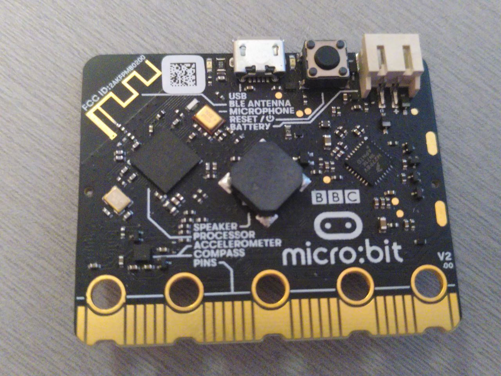
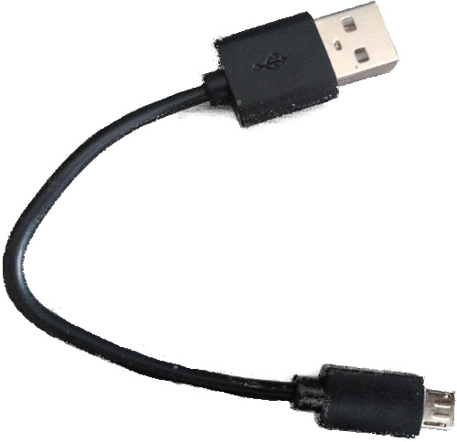

# Requisitos de hardware y conocimientos
Los únicos conocimientos previos que nos harán falta para seguir este curso son los que se requieren para usar Rust. Es muy difícil cuantificar la profundidad necesaria. Sin embargo, es útil estar familiarizado con los conceptos de Tipos genéricos y traits. También deberíamos poder usar closures. Además, es importante conocer las características de la [edicion] actual de Rust.

[edicion]: https://rust-lang-nursery.github.io/edition-guide/

También, se necesitará el siguiente hardware:

- Una placa [Micro:Bit v2] (MB2).

  [micro:bit v2]: https://tech.microbit.org/hardware/

Se puede comprar esta placa en muchos proveedores, incluyendo Amazon y Alí Babá. Se puede conseguir una [lista][0] de proveedores directamente de la BBC, los fabricantes de MB2.

  [0]: https://microbit.org/buy/

  

  
  

  Aunque hay varias variantes de la placa `V2` disponibles, el material aquí escrito se preparó para la versión `V2.00`, pero no debería aparecer ningún problema para cualquier placa con versión `V2.XX`.

- Un cable micro-B USB (nada especial, probablemente tienes varios de estos en casa). Es necesario para alimentar la placa micro:bit cuando no tiene una batería y para comunicarse con ella. Habrá que asegurarse que el cable soporta transferencia de datos, ya que algunos solo están preparados para cargar dispositivos.

  

  
  

> **Nota** Algunos kits de micro:bit incluyen cables. Los cables USB usados con otros dispositivos móviles también deberían funcionar, si son micro-B y tienen la capacidad de transmitir datos.
  
El sitio oficial de `micro:bit Go` proporciona tanto el cable USB como un práctico paquete de baterías para alimentar la MB2 sin USB.
  
> **FAQ**: ¿Por qué necesito este hardware específico?

Básicamente, porque nos hará la vida más fácil y todo mucho más sencillo.

El material es mucho y será más accesible si no tenemos que preocuparnos por las diferencias de hardware.

> **FAQ**: ¿Podría seguir el curso con una placa diferente?

Depende principalmente de dos cosas: la experiencia previa con microcontroladores que tengamos y/o si ya existe un crate de alto nivel para la placa elegida en algún lugar. Probablemente, se necesite al menos un crate HAL, como [`nrf52833-hal`]. Una mejor elección sería una placa que ya tenga un crate con soporte, como la [`microbit-v2`]. Si se tiene la intención de usar un microcontrolador diferente, se puede buscar en [Awesome Embedded Rust] o simplemente intentarlo en la web para encontrar crates compatibles.

[`microbit-v2`]: https://docs.rs/microbit-v2
[`nrf52833-hal`]: https://docs.rs/nrf52833-hal
[Awesome Embedded Rust]: https://github.com/rust-embedded/awesome-embedded-rust

Si nos decidimos por una placa diferente, deberemos tener en cuenta que el material de este curso se escribió específicamente para la MB2 y se perderán las ventajas que presenta. Por lo tanto, es posible que tengamos que hacer algunos ajustes para adaptarlo a la placa que tengamos, estás advertido.

Si trabajamos con una placa de desarrollo basada en una arquitectura Arm diferente y no nos consideramos principiantes, podríamos considerar comenzar con la plantilla de proyecto [quickstart].

[quickstart]: https://rust-embedded.github.io/cortex-m-quickstart/cortex_m_quickstart/
