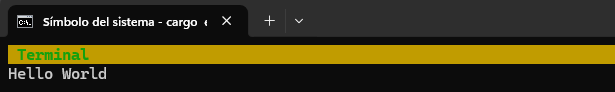

# Verificación de la instalación

Vamos a comprobar que todas las herramientas están correctamente instaladas y funcionan acorde a lo esperado.

## Verificación de cargo-embed

En primer lugar, conectamos la micro:bit al ordenador mediante un cable USB.

Debería encenderse al menos un LED naranja situado justo al lado del puerto USB de la micro:bit. Además, si nunca hemos flasheado otro programa en la micro:bit, el programa predeterminado con el que viene en la micro:bit debería hacer que los LEDs rojos de la parte trasera empiecen a parpadear: podemos ignorarlos o jugar con la aplicación de demostración.

Ahora veamos si probe-rs y por extensión cargo-embed, pueden detectar la micro:bit. Ejecutaremos el siguiente comando:

``` console
$ probe-rs list
The following debug probes were found:
[0]: BBC micro:bit CMSIS-DAP -- 0d28:0204:990636020005282030f57fa14252d446000000006e052820 (CMSIS-DAP)
```

**Nota del tr.:** En mi caso

``` console
$ probe-rs list
The following debug probes were found:
[0]: BBC micro:bit CMSIS-DAP -- 0d28:0204-5:9906360200052820977fb3a6b908b66f000000006e052820 (CMSIS-DAP)
```

O si queremos más información sobre las funciones de depuración de la micro:bit, podemos ejecutar:

``` console
$ probe-rs info
Probing target via JTAG

Error identifying target using protocol JTAG: The probe does not support the JTAG protocol.

Probing target via SWD

Arm Chip with debug port Default:
Debug Port: DPv1, DP Designer: Arm Ltd
├── 0 MemoryAP
│   └── ROM Table (Class 1), Designer: Nordic VLSI ASA
│       ├── Cortex-M4 SCS   (Generic IP component)
│       │   └── CPUID
│       │       ├── IMPLEMENTER: Arm Ltd
│       │       ├── VARIANT: 0
│       │       ├── PARTNO: Cortex-M4
│       │       └── REVISION: 1
│       ├── Cortex-M3 DWT   (Generic IP component)
│       ├── Cortex-M3 FBP   (Generic IP component)
│       ├── Cortex-M3 ITM   (Generic IP component)
│       ├── Cortex-M4 TPIU  (Coresight Component)
│       └── Cortex-M4 ETM   (Coresight Component)
└── 1 Unknown AP (Designer: Nordic VLSI ASA, Class: Undefined, Type: 0x0, Variant: 0x0, Revision: 0x0)


Debugging RISC-V targets over SWD is not supported. For these targets, JTAG is the only supported protocol. RISC-V specific information cannot be printed.
Debugging Xtensa targets over SWD is not supported. For these targets, JTAG is the only supported protocol. Xtensa specific information cannot be printed.
```

**Nota del tr.:** Para mi placa aparece:


``` console
probe-rs info

Probing target via JTAG
-----------------------

Error while probing target: The protocol 'JTAG' could not be selected.

Caused by:
The probe does not support the JTAG protocol.
Probing target via SWD
----------------------

ARM Chip with debug port Default:

Debug Port: DPv1, Designer: ARM Ltd
├── V1(0) MemoryAP
│   └── 0 MemoryAP (AmbaAhb3)
│       ├── 0xe00ff000 ROM Table (Class 1), Designer: Nordic VLSI ASA
│       ├── 0xe0001000 Generic
│       ├── 0xe0000000 Peripheral test block
│       ├── 0xe0040000 Generic
│       └── 0xe0041000 Cortex-M4 ETM   (Coresight Component)
└── V1(1) Unknown AP (Designer: Nordic VLSI ASA, Class: Undefined, Type: 0x0, Variant: 0x0, Revision: 0x0)


Debug port version DPv1 does not support SWD multidrop. Stopping here.
```

Nos movemos ahora al directorio `src/03-setup` de los ficheros fuente. A continuación, ejecutamos los siguientes comandos:

```
$ rustup target add thumbv7em-none-eabihf
$ cargo embed --target thumbv7em-none-eabihf
```

Si todo funciona correctamente, cargo-embed debería compilar primero el pequeño programa de ejemplo
que hay en este directorio, luego lo grabará en la memoria de la placa y por último, abrirá una interfaz de texto en la que se muestre el mensaje "Hello World".

  <p align="center">
  
  </p>

(Si no funciona correctamente, habrá que comprobar las instrucciones que aparecen en [solución general de problemas].)

[solución general de problemas]: ../appendix/1-general-troubleshooting/README.md

Esta salida procede del pequeño programa en Rust que acabamos de cargar en la MB2.
¡Todo funciona correctamente y ya podemos avanzar con los siguientes capítulos!
