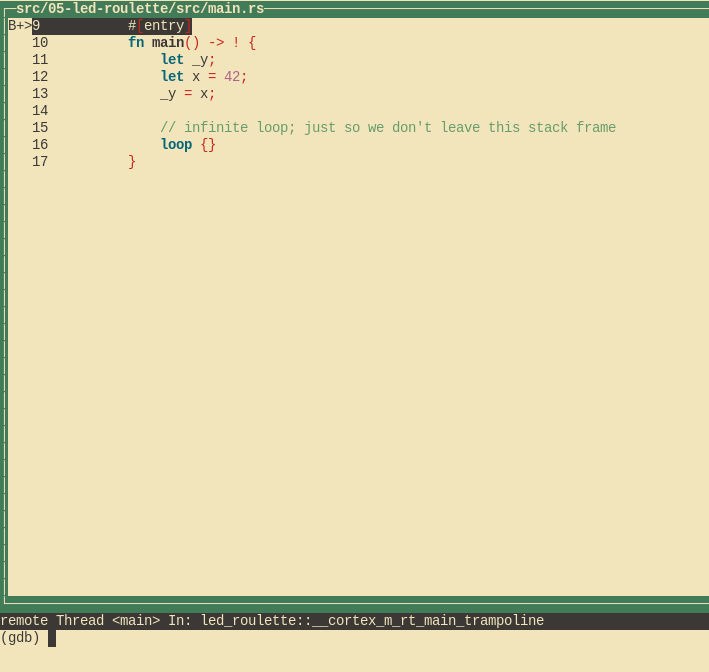
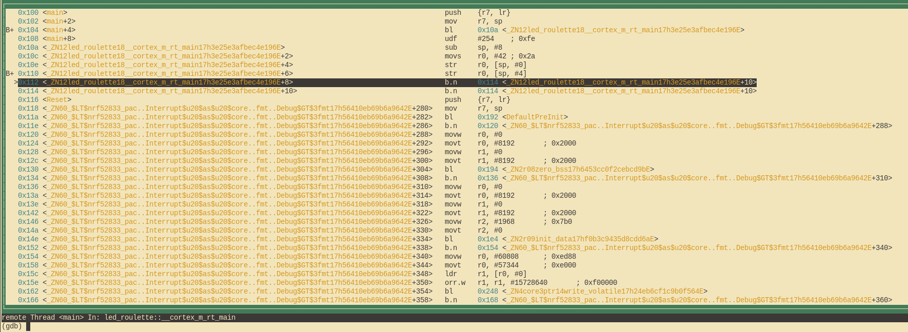

# Depuración
Vamos a descubrir cómo depurar nuestro pequeño programa. Aún no tiene ningún error interesante, pero ese es el mejor tipo de programa para aprender a depurar.


## ¿Cómo funciona esto?

Antes de poder depurarlo, vamos a entender lo que está pasando. En el capítulo anterior ya discutimos el propósito del segundo chip en la placa, además de cómo se comunica con nuestro ordenador, pero ¿cómo podemos usarlo realmente?

La opción `default.gdb.enabled = true` en el fichero `Embed.toml` hace que `cargo embed` abra una sesión de depuración con "GDB" después de flashear el código. Esta sesión es un servidor al que nuestra orden GDB puede conectarse y enviar comandos tales como "establecer un punto de interrupción en la dirección X". El servidor una vez recibido el comando, puede decidir cómo manejarlop. En el caso de la sesión de depuración GDB de `cargo embed`, reenviará el comando a través de USB a la "sonda de depuración" en el segundo chip de la MB2. Este chip hace el trabajo de hablar con el MCU por nosotros.

## Depuremos

`cargo-embed` está ejecutándose en una consola de comandos. Debemos dejar esa consola abierta, ya que es el servidor de depuración. Abriremos otra consola para ejecutar la instrucción GDB. En esa nueva consola, nos dirigiremos a nuestro directorio de proyecto. Una vez allí, primero tenemos que abrir el binario gdb de esta manera:

```shell
$ gdb ../../../target/thumbv7em-none-eabihf/debug/examples/init
```

O bajo windows:
```shell
> arm-none-eabi-gdb ../../../target/thumbv7em-none-eabihf/debug/examples/init
```

> **NOTA** Dependiendo del GDB que tengamos instalado, habrá que usar un comando diferente para lanzarlo. Consulta el [capítulo 3] si olvidaste cuál era.

[capítulo 3]: ../03-setup/README.md#herramientas

La ruta `../../..` de este comando es obligatoria, como este ejemplo pertenece al workspace de todo el libro, en él todos los binarios se generan en el mismo directorio `target`. Si no usáramos esta ruta, GDB no podría encontrar el binario que queremos depurar. Lee [Capítulo sobre espacios de trabajo] para más información.

> **NOTA** Si `cargo-embed` imprime muchas advertencias, no hay que preocuparse. Por ahora no se implementa completamente el protocolo GDB, y por lo tanto podría no reconocer todos los comandos que le está enviando. Mientras GDB no se bloquee, todo está bien.


[Capítulo sobre espacios de trabajo]: https://doc.rust-lang.org/book/ch14-03-cargo-workspaces.html#creating-a-workspace

A continuación tenemos que conectar GDB con el servidor de depuración. Por defecto, este servidor se ejecuta en `localhost:1337`, así que para enlazarnos a él, ejecutamos lo siguiente:

```shell
(gdb) target remote :1337
Remote debugging using :1337
0x00000116 in nrf52833_pac::{{impl}}::fmt (self=0xd472e165, f=0x3c195ff7) at /home/nix/.cargo/registry/src/github.com-1ecc6299db9ec823/nrf52833-pac-0.9.0/src/lib.rs:157
157     #[derive(Copy, Clone, Debug)]
```

> **NOTA** El ejemplo de este capítulo puede cambiar con el tiempo. Los números de línea y otros detalles del código fuente podrían ser diferentes de lo que se muestra.
> Si el programa no se detiene después de lanzarse, o se termina en algún momento posterior durante la depuración, se puede intentar ejecutar `monitor reset halt` para reiniciar la MB2. Esto se debe [a un bug](https://github.com/probe-rs/probe-rs/issues/3438). Para más detalles, consultar [issue #27](https://github.com/rust-embedded/discovery-mb2/issues/27)
> ```shell
> (gdb) target remote :1337
> Remote debugging using :1337
> init::__cortex_m_rt_main () at mdbook/src/05-meet-your-software/examples/init.rs:19
> 19              asm::nop();
> (gdb) monitor reset halt
> Resetting and halting target
> Target halted
> ```

Lo siguiente que queremos hacer es detener la ejecución en la función `main` de nuestro programa. Para ello, primero
estableceremos un punto de interrupción en esa localización y, a continuación, continuaremos con la ejecución del programa hasta llegar al él:

```
(gdb) break main
Breakpoint 1 at 0x104: file src/05-meet-your-software/examples/init.rs, line 9.
Note: automatically using hardware breakpoints for read-only addresses.
(gdb) continue
Continuing.

Breakpoint 1, init::__cortex_m_rt_main_trampoline () at src/05-meet-your-software/examples/init.rs:9
9       #[entry]
```

Los puntos de ruptura se pueden usar para detener el flujo normal de un programa. El comando `continue` permitirá que el programa se ejecute libremente *hasta* que alcance un punto de interrupción. En este caso, hasta que alcance la función `main` porque hemos establecido uno allí.


Indicar que la salida de GDB dice "Breakpoint 1". Recuerda que nuestro procesador solo puede usar una cantidad limitada de estos puntos de interrupción, así que es buena idea prestar atención a estos mensajes. Si por casualidad nos quedamos sin ellos, podemos listarlos con `info break` y eliminar alguno mediante `delete <breakpoint-num>`.

Para una experiencia más agradable, usaremos la Interfaz de Usuario de Texto (TUI) de GDB. Para entrar en ese modo, en la consola de GDB ingresamos el siguiente comando:

```
(gdb) layout src
```

> **NOTA** Disculpas a los usuarios Windows. El GDB distribuido con las herramientas de Arm no soporta este modo. `:-(`.



El comando break de GDB no solo funciona con nombres de funciones: también puede establecer puntos de interrupción en ciertos números de línea. Si queremos definir un punto de interrupción en la línea 13, simplemente podemos hacer:

```
(gdb) break 13
Breakpoint 2 at 0x110: file src/05-meet-your-software/examples/init.rs, line 13.
(gdb) continue
Continuing.

Breakpoint 2, init::__cortex_m_rt_main () at src/05-meet-your-software/examples/init.rs:13
(gdb)
```

En cualquier momento, podemos salir del modo TUI usando el siguiente comando:

```
(gdb) tui disable
```

En este momento estamos situados en la línea 13, justo antes de ejecutar la asignación `_y = x`. Esto significa que `x` ya ha sido inicializada, pero `_y` aún no. Vamos a inspeccionar el valor de `x` usando el comando `print`:

```
(gdb) print x
$1 = 42
(gdb) print &x
$2 = (*mut i32) 0x20003fe8
(gdb)
```

Como esperábamos, `x` contiene el valor `42`. El comando `print &x` imprime la dirección de la variable `x`. Lo interesante aquí es que la salida de GDB muestra el tipo de referencia: `*mut i32`, un puntero a un valor mutable de tipo `i32`.

Si deseamos continuar con la ejecución del programa línea a línea, es posible utilizar el comando `next`. Continuaremos hasta el inicio del bucle `loop {}`:

```
(gdb) next
16          loop {}
```

La variable `_y` ya debería estar inicializada.

```
(gdb) print _y
$5 = 42
```
En vez de imprimir las variables locales una por una, también es factible usar el comando `info locals`:

```
(gdb) info locals
x = 42
_y = 42
(gdb)
```

Si volvemos a usar `next` para avanzar una línea más, nos quedaremos atascados porque el programa nunca pasará de esa declaración. 
En su lugar, cambiaremos a la vista de desensamblado con el comando `layout asm` y avanzaremos una instrucción a la vez usando `stepi`. 
Siempre restauraremos la vista de código fuente de Rust mediante el comando `layout src`.

> **NOTA** En caso de ejecutar el comando `next` o `continue` por error y que GDB se quedara atascado, podríamos salir de esa situación presionando `Ctrl+C`.

```
(gdb) layout asm
```



Si no estamos usando el modo TUI, el comando `disassemble /m` muestra el código desemsamblado alrededor de la línea en la que nos encontramos.

```
(gdb) disassemble /m
Dump of assembler code for function _ZN12init18__cortex_m_rt_main17h3e25e3afbec4e196E:
10      fn main() -> ! {
   0x0000010a <+0>:     sub     sp, #8
   0x0000010c <+2>:     movs    r0, #42 ; 0x2a

11          let _y;
12          let x = 42;
   0x0000010e <+4>:     str     r0, [sp, #0]

13          _y = x;
   0x00000110 <+6>:     str     r0, [sp, #4]

14
15          // infinite loop; just so we don't leave this stack frame
16          loop {}
=> 0x00000112 <+8>:     b.n     0x114 <_ZN12init18__cortex_m_rt_main17h3e25e3afbec4e196E+10>
   0x00000114 <+10>:    b.n     0x114 <_ZN12init18__cortex_m_rt_main17h3e25e3afbec4e196E+10>

End of assembler dump.
```
El puntero de ejecución `=>` muestra la siguiente instrucción que el procesador ejecutará.

Dentro del modo TUI, cada vez que tecleamos `stepi`, GDB imprime la línea de código fuente que corresponde a la instrucción que se ejecutará a continuación y su número de línea.

```
(gdb) stepi
16          loop {}
(gdb) stepi
16          loop {}
```

Una atajo antes de pasar a algo más interesante. Introducimos el siguiente comando en GDB:

```
(gdb) monitor reset
(gdb) c
Continuing.

Breakpoint 1, init::__cortex_m_rt_main_trampoline () at src/05-meet-your-software/src/main.rs:9
9       #[entry]
(gdb)
```

Nos hace retornar al comienzo del programa en `main`.

El comando `monitor reset` resetea el microcontrolador y lo para en el punto de entrada.
La orden `continue` hace que el programa se ejecute hasta que alcance el punto de interrupción que establecimos en `main`.

Este conjunto de comandos es útil cuando, por error, saltamos una parte del programa que nos interesaba inspeccionar. De esta manera podemos restaurar fácilmente el estado del programa a su inicio.


> **Una anotación**: Este comando de `reset` no limpia ni modifica la RAM. Mantendrá los valores de la ejecución anterior. 
> Eso no debería ser un problema, a menos que el comportamiento del programa dependa del valor de variables *no inicializadas* — pero esa es la definición de Comportamiento Indefinido (UB).


Ya hemos terminado la sesión de depuración. Podemos salir con el comando `quit`.

```
(gdb) quit
A debugging session is active.

        Inferior 1 [Remote target] will be detached.

Quit anyway? (y or n) y
Detaching from program: $PWD/target/thumbv7em-none-eabihf/debug/meet-your-software, Remote target
Ending remote debugging.
[Inferior 1 (Remote target) detached]
```

> **NOTA** Si el cliente por defecto GDB no se está conectando correctamente, revisa [gdb-dashboard]. Esta herramienta usa Python para convertir la interfaz de línea de comandos de GDB en un panel de control que muestra los registros, la vista del código fuente, la vista de ensamblado y otras cosas.

[gdb-dashboard]: https://github.com/cyrus-and/gdb-dashboard#gdb-dashboard

Si quieres aprender más sobre GDB, echa un vistazo a la sección [Cómo usar GDB](../appendix/2-how-to-use-gdb/README.md).


## Depuremos bajo WSL2 en Windows
La depuración bajo Windows WSL es un poco más compleja debido a que se comparten recursos entre Windows y WSL. 
Sin embargo, es posible usar `usbipd` para compartir un dispositivo USB con WSL2. Para más información, consultar la documentación oficial de Microsoft sobre cómo conectar dispositivos USB a WSL2 en https://learn.microsoft.com/es-es/windows/wsl/connect-usb

En general los pasos a seguir serán:

1º Instalar la última versión de usbipd https://github.com/dorssel/usbipd-win/releases/latest. Esta instalación solo se hará la primera vez, no es necesario repetirla cada vez que queramos depurar bajo WSL2.

2º Bajo un Shell con la MB2 ya conectada, ejecutar: 
```shell
c:\usbipd list  --> Buscar busid (1-2 en mi caso)
```
3º Abrir Una terminal WSL.

4º Abrir un consola PowerSell o Una consola de comandos en modo Administrador
```shell
usbipd bind --busid 1-2  --> El busid puede variar, revisar el paso 2
usbipd attach --wsl --busid 1-2
```
5º Dentro de la consola WSL ya podemos depurar mediante gdb o su correspondiente gdb-multiarch:
```shell
lsusb
probe-rs list
```
6º Cerrar todo menos la consola WSL

Para finalizar la sesión de depuración, es necesario desconectar el dispositivo USB compartido con WSL2. Esto se puede hacer desde una consola de comandos en modo Administrador bajo Windows, ejecutando el siguiente comando:
```shell
usbipd detach --busid 1-2 --> El busid puede variar, revisar el paso 2
usbipd unbind --busid 1-2 --> El busid puede variar, revisar el paso 2

```
o quitar el usb del puerto directamente.

¿Qué es lo siguiente? La API de alto nivel que prometimos.
