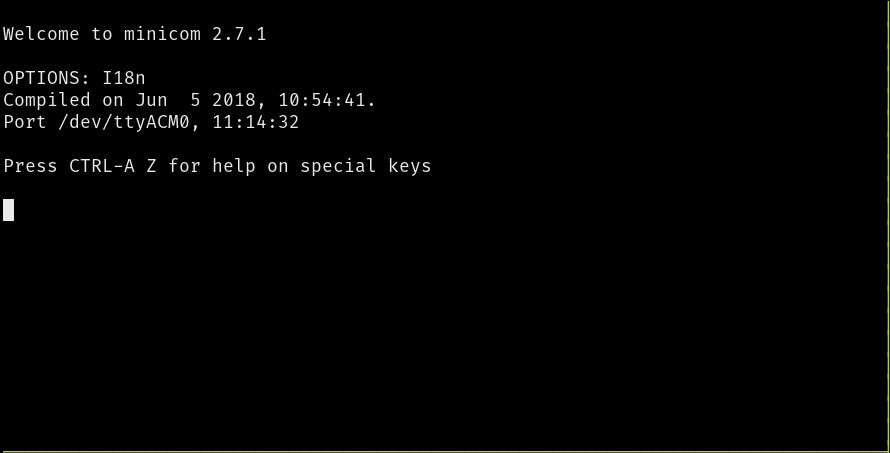

# Linux USB←→serial

La emulación serie USB de la placa MB2 se reconoce automáticamente cuando se conecta el MB2 a un puerto USB de Linux.

## Conectando la placa MB2

Si conectas la placa MB2 al ordenador, tendría que aparecer un nuevo dispositivo TTY en el directorio
`/dev`.

``` console
$ sudo dmesg -T | tail | grep -i tty
[63712.446286] cdc_acm 1-1.7:1.1: ttyACM0: USB ACM device
```

Este es el dispositivo USB←→serie. En Linux, se llama `tty` (por "TeleTYpe", lo creas o no). Debería aparecer como `ttyACM0`, o tal vez `ttyUSB0`. Si hay otros dispositivos "ACM" conectados, el número será más alto. (En MacOS `ls /dev/cu.usbmodem*` mostrará el dispositivo serie.)

Pero ¿Qué es exactamente `ttyACM0`? Es un fichero, por supuesto. ¡Todo es un fichero en Unix!

```
$ ls -l /dev/ttyACM0
crw-rw----+ 1 root plugdev 166, 0 Jan 21 11:56 /dev/ttyACM0
```
Ten en cuenta que, para leer y escribir en este dispositivo, deberemos estar ejecutando el comando como `root` (no recomendado) o ser miembro del grupo que aparece en la salida de `ls` (normalmente `plugdev` o `dialout`). A continuación, podemos enviar datos simplemente escribiendo en este archivo:

``` console
$ echo 'Hello, world!' > /dev/ttyACM0
```
El LED naranja del MB2, justo al lado del puerto USB, parpadeará por un momento cada vez que ejecutemos esta orden. La velocidad de transmisión y otros parámetros de la comunicación pueden no estar configurados correctamente para el puerto serie del MB2, pero puede detectar que se le están enviando datos en serie.

## minicom

Usaremos la orden `minicom` para interactuar con el dispositivo serie usando el teclado. Estableceremos la configuración predeterminada de `minicom`: 115200 bps, 8 bits de datos, un bit de parada, sin bits de paridad, sin control de flujo. (115200 bps es una velocidad reconocida por el MB2.)


``` console
$ minicom -D /dev/ttyACM0
```

El comando anterior ejecuta `minicom` con la opción `-D` para especificar el dispositivo serie con el que comunicarnos.


<p align="center">

</p>

Ahora podemos enviar datos mediante el teclado. Adelante, escribe algo. Ten en cuenta que la interfaz de texto *no* mostrará lo que escribes. Sin embargo, si prestas atención al LED amarillo en la parte superior del MB2, notarás que parpadea cada vez que tecleamos algo.

## Comandos `minicom`

`minicom` facilita varios comandos a través de aceleradores de teclado. En Linux, todos empiezan con la pulsación de `Ctrl+A`. (En Mac se usa la tecla `Meta`.) Algunos atajos interesantes son:

- `Ctrl+A` + `Z`. Resumen de comandos
- `Ctrl+A` + `C`. Limpiar la pantalla
- `Ctrl+A` + `X`. Salir y reiniciar
- `Ctrl+A` + `Q`. Salir sin reiniciar

> **NOTA** Usuarios Mac: Para las órdenes anteriores, hay que remplazar la secuencia `Ctrl+A` por `Meta`.
