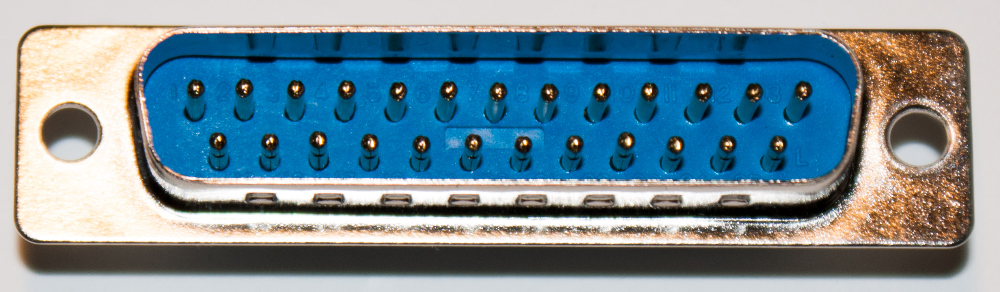
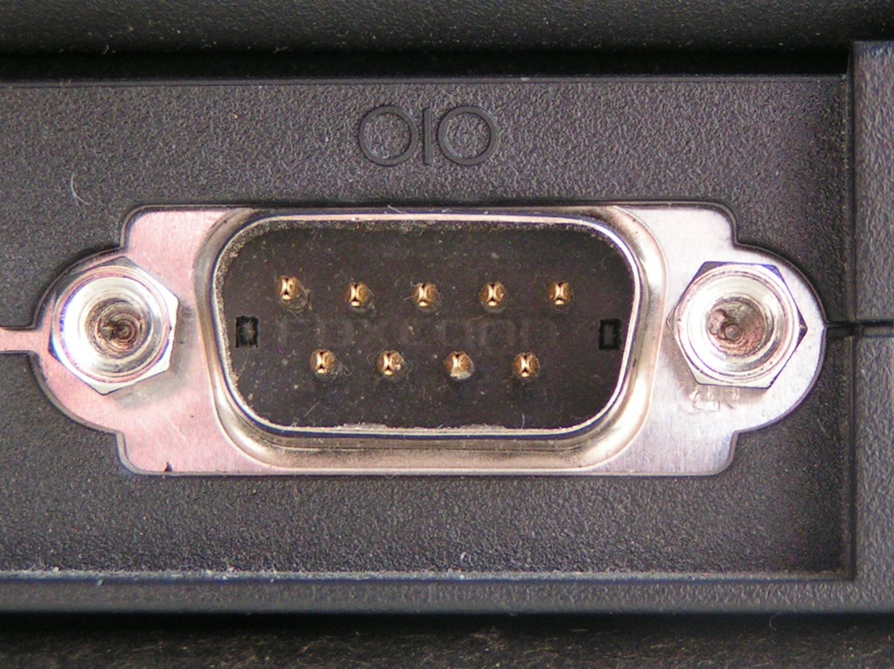

## RS-232

Esta sección es opcional, pero puede ser útil conocer esta información para hablar con personas sobre el puerto serie en un futuro.

Los primeros puertos serie aparecen sobre los años 60, cuando un estándar llamado [RS-232] (Revised Standard 232; no parece haber una versión "no revisada" de este estándar) se hizo popular. Sería interesante echar un vistazo al [Estándar RS-232]: si tienes unos US$65 por ahí que estás deseando regalar a la Telecommunications Industry Association, adelante. (Las asociaciones industriales tienden a perder completamente el concepto de "vergüenza". En fin.)

El 
RS-232 se diseñó para conectar equipos de comunicaciones de datos (DCE; un MODEM) a equipos terminales de datos (DTE; un terminal) utilizando solo un cable para enviar datos en cada dirección. El protocolo utilizado para los datos se describe en otra parte de este tema. Las velocidades de transmisión eran ajustables: era típico usar la velocidad de datos de un MODEM cuando se usaba uno, por lo que las velocidades "estándar" de RS-232 tendían a ser también velocidades "estándar" del MODEM: 300bps, 600bps, 1200bps, 2400bps, 9600bps, etc.

Soporta un conjunto de líneas para señalización de control ("handshaking", cada elemento podía indicar que estaba ocupado y que no admitía datos en ese momento) y varias funciones telefónicas ("¿Está sonando el teléfono?", "Descolgar el teléfono", etc.). RS-232 utilizaba un conector "D" de 25 pines; los voltajes de señalización eran -12V para alto y +12V para bajo, un estándar antiguo de la compañía telefónica.

<a href="https://commons.wikimedia.org/wiki/File:DB-25_male.jpg">

</a>

Cuando los ordenadores se conectaron entre sí, el protocolo RS-232 se volvió poco práctico. Los ordenadores grandes solían configurarse como DCE para comunicarse con los terminales, mientras que los microordenadores solían configurarse como DTE para comunicarse con los módems.

El IBM-PC popularizó un conector de 9-pines (DE-9, generalmente llamado como DB-9) para el puerto RS-232.

<a href="https://commons.wikimedia.org/wiki/File:Serial_port.jpg">

</a>

Con el tiempo, se generalizó la práctica de eliminar la mayoría o la totalidad de los cables en los puertos serie, reduciéndolos a una interfaz de tres hilos (transmisión, recepción y tierra). También se hizo habitual utilizar 0V/+5 V y, más tarde, 0V/+3,3V como niveles de señal, para evitar tensiones "extrañas" y problemas con la interfaz.

Microsoft diseñó deliberadamente USB como un estándar para reemplazar RS-232; este era con el diseño del cableado, varios tipos de conectores, diferentes voltajes y velocidades de transmisión, demasiado difícil de usar por el consumidor de a pie para conectar dispositivos al PC. 
Debido a que la mayoría de los MODEMs todavía eran RS-232 en el momento en que salió USB, Microsoft diseñó una "clase de dispositivo" USB, CDC-ACM, específicamente para comunicarse con los adaptadores RS-232 utilizados con estos MODEMs.

[RS-232]: https://en.wikipedia.org/wiki/RS-232
[Estándar RS-232]: https://store.accuristech.com/standards/tia-rs-232?product_id=2591953
