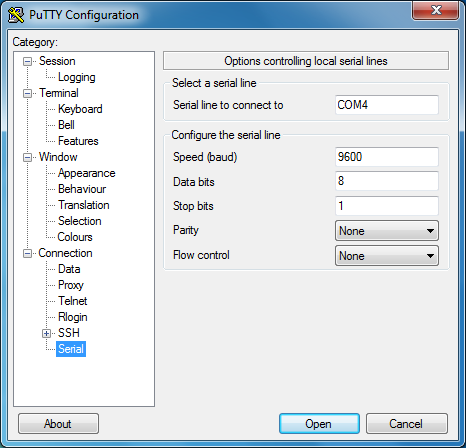
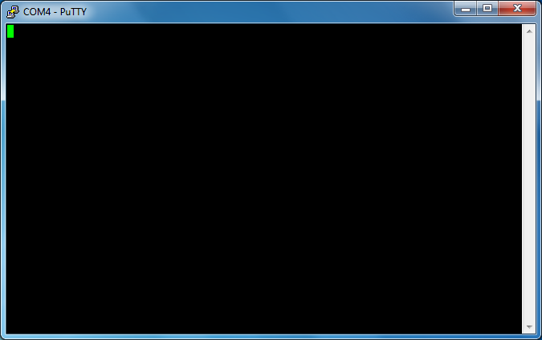

# Windows USB←→serie

Lo primero es desconectar el MB2.

Antes de volver a conectar el MB2, ejecutaremos el siguiente comando en la terminal:

``` console
> mode
```

Se imprimirá una lista de dispositivos que están conectados al ordenador. Los que empiezan con `COM` en sus nombres son dispositivo serie. Este es el tipo de dispositivo con el que trabajaremos. Anotaremos las salidas de la orden `mode` de todos los puertos `COM` *antes* de conectar el módulo serie.

Conectamos la placa MB2 y ejecutamos de nuevo el comando `mode`. Deberíamos ver un nuevo puerto `COM` en la lista, ese es el puerto COM asignado al puerto serie del MB2.

Ya podemos lanzar `putty`. Aparecerá una ventana.

<p align="center">

</p>

En la ventana de inicio, debería estar la categoría "Session" abierta. En el campo "Connection type", seleccionamos "Serial". En el campo "Serial line", introducimos el dispositivo `COM` que obtuvimos en el paso anterior, por ejemplo `COM3`.

A continuación, pulsamos en la categoría "Connection/Serial" del menú de la izquierda. En esta nueva vista, hay que asegúrase que el puerto serie esté configurado de la siguiente manera:

- "Speed (baud)": 115200
- "Data bits": 8
- "Stop bits": 1
- "Parity": None
- "Flow control": None

Para terminar, hacemos clic en el botón de "Open". La consola mostrará algo como:

<p align="center">

</p>

Si escribimos en esta consola, el LED amarillo en la parte superior de la MB2 parpadeará. Cada pulsación de tecla debería hacer que el LED parpadee una vez. Hay que tener en cuenta que la consola no mostrará lo que escribimos, por lo que la pantalla estará vacía.

