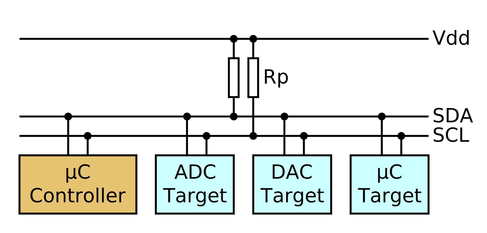

# I2C
Ya hemos visto el formato de comunicación con la UART. La comunicación en serie es ampliamente utilizada porque es simple y ha existido casi desde siempre. (¿Recuerdas por qué se llama al dispositivo host "tty"? Por "TeleTYpe" sí, eso.) Esta ubicuidad y simplicidad lo convierte en una opción muy popular para comunicaciones simples.

Por las limitaciones de longitud para que la calidad de la señal sea buena y por la dificultad de una decodificación precisa, el protocolo serie se limita generalmente a unos 115200 baudios en condiciones ideales. Un puerto serie UART tiene tanto un ancho de banda bajo (11.5KB/s) como una alta latencia (87µs/byte).

El puerto serie es punto a punto: no hay forma de conectar tres o más dispositivos al mismo cable y cada cable requiere un dispositivo de hardware dedicado en cada extremo.

Lo bueno (y lo malo) es que hay *muchos* otros protocolos de comunicación en serie asistidos por hardware entre los dispositivos embebidos que superan estas limitaciones. Algunos de ellos se utilizan ampliamente en sensores digitales.

La placa micro:bit que estamos usando tiene dos sensores de movimiento: un acelerómetro y un magnetómetro. Ambos sensores están empaquetados en un solo componente y se pueden acceder a través de un bus I2C.

El protocolo I2C es un acrónimo de Inter-Integrated Circuit o Circuito Inter-Integrado. Es un protocolo de comunicación en serie *síncrono* que utiliza dos líneas para intercambiar datos: una línea de datos (SDA) y una línea de reloj (SCL). La línea de reloj se utiliza para sincronizar la comunicación. La comunicación en serie síncrona puede funcionar más rápido y de manera más fiable que la comunicación en serie asincrónica. Los dispositivos I2C tienen *direcciones de bus*: la implementación de hardware permite enviar bytes a un elemento en particular, mientras que otros conectados a los mismos cables ignoran esta comunicación.

<a href="https://commons.wikimedia.org/wiki/File:I2C_controller-target.svg">

</a>

I2C usa un modelo de *controlador*/*dispositivo*: el controlador es el elemento que *inicia* y dirige la comunicación con un dispositivo objetivo. Varios componentes pueden estar conectados al mismo bus a la vez y pueden elegir actuar como controlador o como destino. Un controlador puede comunicarse con un dispositivo específico transmitiendo primero la dirección hardware deseada al bus. Esta dirección puede tener 7 bits o 10 bits de longitud. Una vez que un controlador ha iniciado una comunicación con un objetivo, ningún otro dispositivo que no sea el controlador y el destino tiene permitido transmitir en el bus hasta que el controlador finalice la comunicación.

> **NOTA** "Controlador/dispositivo" se denominaba anteriormente como "maestro/esclavo". Aún se puede encontrar en la literatura o etiquetado en las placas. Esta terminología ahora está obsoleta tanto en los estándares oficiales como en documentos más recientes, pero se utiliza en el manual de Nordic de nuestro chip nRF52833 y en algunos documentos de Rust embebido.

La línea de reloj determina la velocidad con la que se pueden intercambiar los datos. La interfaz I2C del MB2 puede operar a velocidades de 100, 250 o 400 Kbps. Con otros dispositivos, incluso son posibles modos más rápidos.
