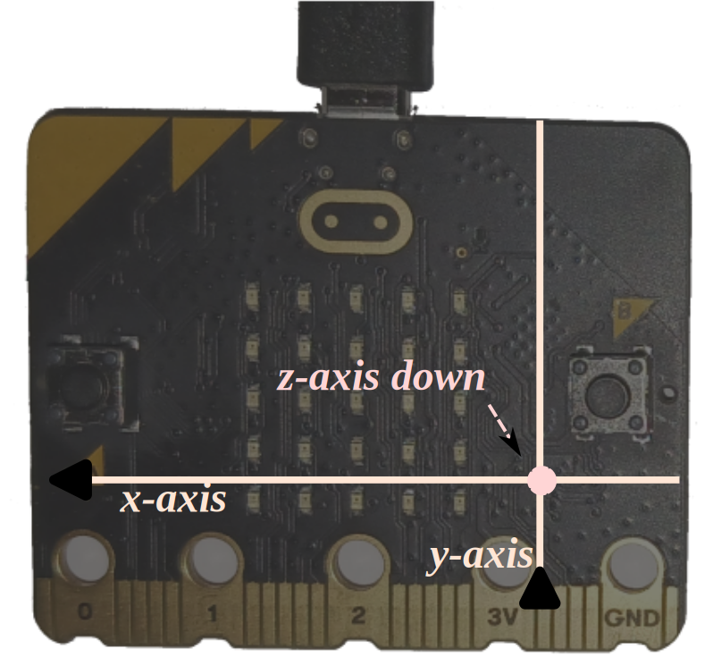

# Brújula LED

En esta sección, vamos a implementar una brújula usando los LEDs del MB2. Como las brújulas
normales, la nuestra debe apuntar hacia el norte. Esto lo haremos al encender uno de sus LEDs; el LED encendido debe apuntar hacia el norte.

Los campos magnéticos tienen tanto una *magnitud*, medida en Gauss o Teslas, como una *dirección*. El magnetómetro del MB2 mide tanto la magnitud como la dirección de un campo magnético externo, pero la información de campo la presenta *descomponiéndola en sus ejes* proporcionando tres valores.

El magetonómetro tiene tres ejes asociados. Cuando la placa se sostiene en posición horizontal, con los LEDs mirando hacia arriba y el logotipo hacia delante, los ejes X e Y abarcan el plano que constituye el suelo. El eje X apunta hacia el borde izquierdo de la placa. El eje Y apunta al borde inferior (conector de la tarjeta) de la placa.  El eje Z apunta "hacia el suelo", es decir, hacia abajo: "al revés", ya que el chip está montado en la parte trasera. Se trata de un sistema de coordenadas "diestro". Todo esto resulta un poco confuso, porque las intensidades de campo indicadas son componentes del vector del campo magnético.

Con esta información podríamos escribir un programa que imprimiese continuamente los datos del magnetómetro en la consola RTT como en el [capítlo I2C](../12-i2c/README.md). Después de crear ese programa (`examples/show-mag.rs`), sería fácil localizar dónde está el norte. Si alineamos la MB2 con esa dirección, observamos qué valores aparecen en las mediciones X e Y del sensor.

Después, giramos la placa 90 grados mientras se mantiene paralela al suelo. ¿Qué valores de X, Y y Z se ven esta vez? Luego la rotamos 90 grados más. ¿Qué valores hay?

>**NOTA** De las dos MB2s que tengo a mano al momento de escribir este libro, una de ellas tiene el sensor que no funciona bien: el eje Z está desfasado, de manera que no se puede usar. El fabricante tiene un proceso de auto-prueba para detectar este tipo de fallos y un proceso de calibración para mitigarlos, que suele ser el resultado de exponer el MB2 a un campo magnético fuerte en algún momento. Sin embargo, el crate `lsm303agr` actualmente no soporta ninguno de estos, y parece mucho para una guía introductoria a los sistemas embebidos. Si solo tenemos una MB2 y no parece funcionar, es posible que queramos saltar hasta el [siguiente capítulo]. Hardware barato: ¿qué vamos a hacer?

[siguiente capítulo]: ../14-punch-o-meter/README.md

El polo norte magnético de la Tierra es algo caprichoso: difiere del norte verdadero en la mayoría de los lugares de la Tierra, a veces de forma considerable. Cambia con el tiempo.
Si no se tiene en cuenta todo esto, no se obtendrá una brújula muy precisa, aunque el magnetómetro de la MB2 sea perfecto (que no lo es). Esta calculadora de la NOAA de EE.UU.
<https://www.ngdc.noaa.gov/geomag/calculators/mobileDeclination.shtml> nos da una estimación del polo norte real así como del magnético; Se puede introducir en esta [calculadora] del BGS del Reino Unido nuestra latitud, longitud y altitud para obtener tanto la declinación como la inclinación magnética. En mi ubicación, la "declinación" (diferencia entre el norte verdadero y el norte magnético) es de unos 15°; la "inclinación" es de unos sorprendentes 67° hacia el interior de la tierra.

> **Nota del tr.:** en mi posición los datos son declinación de 0,73º y una inclinación de 55,4º.

[calculadora]: http://www.geomag.bgs.ac.uk/data_service/models_compass/wmm_calc.html

> **NOTA** El magnetómetro LSM303AGR no es un dispositivo particularmente preciso en el momento
> de la compra. El fabricante recomienda un procedimiento de calibración para ajustar 
> las lecturas. Se Puede encontrar más información, una implementación de calibración de 
> ejemplo y algunos gráficos en [apéndice 3]: dado que estamos haciendo algo 
> bastante básico con el magnetómetro, no nos preocuparemos por ello en este capítulo.

[apéndice 3]: ../appendix/3-mag-calibration/README.md
