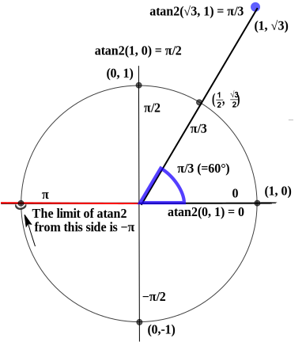

# El reto

Vamos a usar algo de matemáticas para conseguir el ángulo exacto del campo magnético a partir de los ejes X e Y del magnetómetro. Esto nos permitirá averiguar qué LED apunta al norte.

Usaremos la función `atan2` de Rust. Esta función devuelve el ángulo en el rango de `-PI` a `PI`. El gráfico a continuación muestra cómo se mide este ángulo:

<a href="https://commons.wikimedia.org/wiki/File:Atan2_60.svg">
<p align="center">

</p>
</a>

Aunque no se muestra explícitamente, en este gráfico el eje X apunta hacia la derecha y el eje Y apunta hacia arriba. Hay que tener en cuenta que nuestro sistema de coordenadas está girado 180° con respecto a este.

Podemos encontrar la plantilla en `templates/compass.rs`. `theta`, en radianes, ya está calculado. Necesitamos elegir qué LED encender en función del valor de `theta`.

```rs
{{#include templates/compass.rs}}
```

Sugerencias:

- Un círculo completo son 360 grados.
- `PI` radianes equivalen a 180 grados.
- Si `theta` es cero, ¿hacia qué dirección se está apuntando?
- Si `theta` está muy cerca de cero, ¿hacia qué dirección está apuntando?
- Si `theta` sigue creciendo, ¿en qué valor debería cambiar la dirección?
